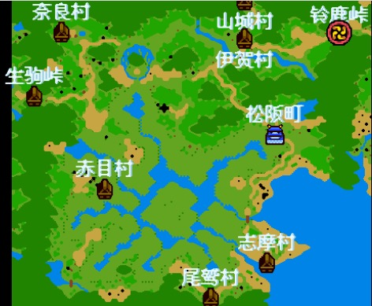
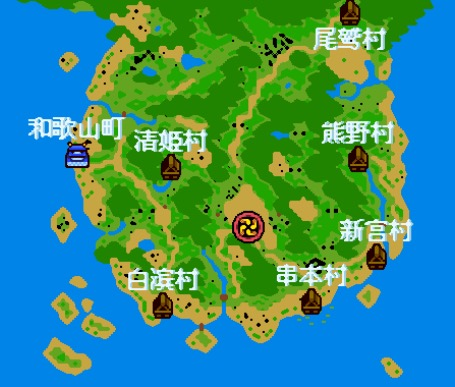

> 《天外魔境》系列作以“火之一族”的传说为主干，本作叙述日本关西地方的火之一族末裔卍丸、歌舞伎团十郎、极乐太郎与绢等4人，为了消灭危害世间的的闇黑兰，打倒背后的黑手“根”之一族与恶神“幽冥”，而出发展开冒险。

**需要注意的几点：**

　　1、游戏中得到的重要道具都和剧情流程有关，如身上放不下，请先放在“预馆”保存，以备以后需要取用。

　　2、从天狗之庵取的卷物其实就是魔法书，应多多收集。

　　3、每到一地注意对话收集情报。会有下一步提示。

　　4、得到或购买新装备请及时装备在身上。

**本流程攻略修改自：[《天外魔境2》流程实用攻略](http://nds.tgbus.com/ndsgl/200603/20060318172000.shtml)**

## **火多国**

　　白川村卍丸从家2楼用绳勾来到神社叫伙伴出村→往高山町去右边宿屋拜见太君，再去左边宿屋2楼有卍字的地方休息， 祭典开始，剧情(出现死神三兄弟及暗黑兰)后， 卍丸一人出高山町

→回白川村的家发现母亲春已经被死神三兄弟抓到两面窟，在村中道具屋半价购买物品→向东到牛首村买装备→向南找天狗之庵得雷光卷物，向北找天狗之庵得若草卷物， 往东走，过桥，到碳烧小屋休息。

从碳烧小屋向南→到两面窟救人，在3楼两次击败BOSS回白川村剧情后得(重要道具)武器“形见之剑”（遗物之剑）和防具“阵羽织”出村

→高山町→西南方的关所→到马濑村宿屋2楼和一人对话得道具泥沼恋文 →带着礼物面团子去村东南方天狗之庵得羽衣卷物→马濑村→向南去绳文洞，在出口击败BOSS到尾张国。

## **尾张国**

　　向西到犬神町，发生歌舞伎团十郎剧情，暂时不会加入，去有团十郎的屋子，和右上方女子对话把泥沼恋文交给她，顺便在茶馆买一个“美素团子”带上备用→去稍下方蛇仙人洞(两次进入)， 蛇仙人会让挡开宝箱的路，得(重要道具) 恋の耳かき→向东去长筱町休息→往长筱町上方的瀑布，对着地藏菩萨使用“美素团子”，就会出现地洞入口，(2层泉水能回复)出地洞向左→天狗之庵得鬼火卷物→往东去伞岩仙人的洞得(重要道具) ヘタな绘（拙劣的画），再向东→福岛村，在村中对着地藏菩萨使用ヘタな绘（拙劣的画），就会得到画中船→往上方去天狗之庵得风花卷物→乘船南下→至湖中的弁天塔→在3楼BOSS战后对着锁着的门使用(重要道具) 恋の耳かき（恋爱的耳环），救下弁天公主去在右下得到(重要道具) 净土琵琶→去鬼骨城对着大门使用净土琵琶破解封印的门在2F，3F，4F击败敌人，5F打败死神将军，得到(重要道具)七圣剑之一的法水院红丸→回火多国高山町，对着暗黑兰使用圣剑消灭它吧！ →往以前不能进入的绳文洞入口西北方向天狗之庵得阳炎卷物→回尾张国犬神町不见团十郎→去往伊势国→铃鹿宿屋顶上遇见团十郎加入，这下终于有伙伴了！

## **伊势国**

　　到伊贺村发生团十郎和菊五郎的剧情后，调查村中的灯，水井会移开出现秘道，内有密秘武器屋和宝香卷物。和2楼伊贺忍者头头的手下亲信对话得(重要道具) 一把石川のカキ（石川的钥匙）， 出村往南走→松板町整理装备后经→伊势神宫→志摩村，在村右下方使用石川のカキ（石川的钥匙）开锁，调查鱼网得(重要道具) 天章之笛，出村在村外的四方平台上使用天章之笛， 可以乘坐岩舟来往于伊势国各个四方平台，依次使用在左下天狗之庵得月寝卷物， 乘岩舟 →赤目村→根来古墓在古墓1层地面会有字，请记住你走过地面的字，在电网前倒过来输入你走过的字母就会关掉电网，我的路线是“ィ　ヲ　ェ　ウ　ロ　ゴ　ク　キ”正确输入口令：“キクゴロウェヲィ”【汉化版的密码为：菊五郎非常的伟大】2层输入同样的口令关掉电网，3楼BOSS战后救下伊贺忍者头头。 →伊贺村，伊贺忍者头目会给卍丸(重要道具)叹きの指轮（悲叹的戒指）和团十郎(重要道具)变化の法印，并让他三个女儿帮助卍丸，前往纪伊国。

## **纪伊国**

　　→尾鹫村往南来到中部的叹きの谷（悲叹之谷），坐左边的小缆车到谷中间落入谷中，对石像使用(重要道具)叹きの指轮出现イヒカの村（伊希卡村）从村中宝箱得(重要道具)四水之镜和卷物天人，从传送点出来到

→新宫村→先去串本村剧情后→串本村村中向上走通过地道来到海岛上对石像使用四水之镜，会出现通路得(重要道具) “**一号铜铎**”→往熊野村对石像使用四水之镜会出现通道进入神社里面有一排机关，排列为“上上上下上”会打开右面机关拿宝箱， 排列为“上下下上下”进入在最下层得到神之船，乘坐按NDS的B键打开菜单选右下的炮击选项击破大门

→去新宫村右边的神殿取宝吧！开炮击碎岩石沿岸往右上走， 天狗之庵得母忘卷物。 

→往西南下行至白滨村在神社内的后面进入对石像使用四水之镜，再去宿屋温泉内的暗道得“**二号铜铎**”→去左下方海岛天狗之庵得泥虫卷物，往上方航行天狗之庵得卷物冬枯， 

→在和歌山町楼顶，团十郎和菊五郎斗法， 团十郎用变化の法印击退菊五郎得(重要道具) 山门のカキ（山门的钥匙）→去龙神洞【在和歌山町的下方】找到海盗的三件宝贝顺路来到→清姬城洞窟对石像使用四水之镜，挡路的喷泉就会消除，进入神社BOSS战，得“**三号铜铎**”→高野山。

　　使用(重要道具) 山门のカキ（山门的钥匙）打开石门在三楼发生BOSS战，上4楼对石像使用四水之镜，得“**四号铜铎**”

→回伊势国奈良村旁的妙院按左上，右上，左下，右下的次序装好1。2。3。4号铜铎得到イヒカの巨人， →乘巨人来到伊势国中间的密林城，一路杀到5层BOSS战打败菊五郎的本体得第二把圣剑妙院卡拉斯→拿圣剑去伊势神宫消灭暗黑兰下面去京吧……

**京**

　　山城村向左上走→京都商店区左方宿屋前和村民对话会有剧情，右边宿屋前和两个女子对话会得33。34奖券(正月会开奖)， 贫民区桥下房中对话会有剧情， 御所区左方楼上宝物库有重要剧情道具白山的“入山许可证”， 宝库のカキ（宝库的钥匙）在御所区中间楼上花圃中。

→出京都往右上行到信乐村帮老狸猫去京都买千年人蔘后，会得残火卷物。过桥右下天狗之庵得雷电卷物， →往上走穿过右边伊吹天狗之庵得卷物野分。 →北上去逢板到近江东。

## **近江东**

　　逢板→朝北走到大津村村左的红湖是琵琶湖， 岸边的桥连接的房子里， 火之母玛理需消灭七朵暗黑兰后再来触发情节【所以现在去也没用】。 →白山的山洞需(重要道具) “入山许可证”才能进入，在3层上巨船→琵琶湖西的西京洞内有金刚卷物， →右上方坐船来到金泽町前往越前国。

## **越前国**

　　金泽町找城主。【这里需要寄存所有的武具包括衣服，才能进城主家。如果此时身上装备有[不雅的衣服]，将无法脱下着衣服，导致流程无法继续。可以通过去旅店休息，之后就会解开这件衣服的诅咒。】对话后，城门才能打开， 团十郎在这会暂时离开对伍……

出金泽町左下是→木ノ叶（木之叶峠），往下独自一人来到→福井村

→东北方是押水村途中会有はまぐり姬（蛤蜊公主）手下的五个法师用鬼面岩堵路剧情，路上天狗之庵得清水卷物， 押水村北方的金谷洞内有(重要道具) 闇牡丹花，不过目前你的能力一人去，就会知道“死”字是怎么写，收了伙伴再来吧！

再向北过桥→轮岛村→轮岛村东面天狗之庵能减少使用一种技能点数1点。 轮岛村南方的一个山洞会来到人鱼村中央大屋中间得人鱼百合花，和鱼王对话，得知旁边的笼中关着极乐

→轮岛村看人鱼表演后， 救出人鱼公主和三太→押水村宿屋睡一觉，门口得宝箱防具鳞光衣→然后前往人鱼村，极乐太郎成为伙伴

→金谷洞拿闇牡丹花， →去挡路的鬼面岩发生剧情。从最上方通道走天狗之庵得火天卷物，这附近还有(重要道具)雪割樱花【在大地图上很明显可以看到，先收集】，不过要发生电二郎情节才会在此出现！ 

→ 越中富山町请把卍丸的道具给极乐先存放着(原因马上就明白)……

## **越中国**

　　富山町去找城主对话后门就会打开→往右下弥陀ケ原洞窟（弥陀原洞窟）内有黄金虫卵，给卍丸拿着，(如卍丸还有道具在包中，黄金虫之卵就回孵化，吃掉你的道具，要是有关键的剧情道具，那就惨了……用法术回京都住宅区卖给一收黄金虫之卵的住民可得10000元……口水！ →再回弥陀ケ原洞窟（弥陀原洞窟）

【弥陀原洞窟】

这里卡住了一段时间，最后研究出来走法了。当我们从大地图，进入洞窟，进入后这里为第一层。之后往右边走，进入一个小洞口，里面为一个小空间，这里为第二层。从这里出去，发现并不是回到第一层，此时会发现有好多个卍丸，这里我称为 第三层。之后再走，下楼梯，进入另一个空间，这里有好几个宝箱。为第四层。这个第四层没有出口了，但它并不是死路。这时只需要上楼梯返回第三层，再从第三层下楼梯，就可以到达第五层。之后继续往下走，就可以看到 boss 【矶花法师】。

在出口打败矶花法师，前往→西北方天狗之庵得卷物逃水→往下到美女平村→去山南面地狱谷村，途中左上天狗之庵得花道卷物，在其门口可以得(重要道具)血车草花，往东南向有力王卷物， →向北去达宇奈月洞出口挑战卷贝法师→越后国

## **越后国**

　　向下→三条村找电二郎的屋子(屋右上有越の金梅の花)，需替电二郎配还魂丹→去东北边新泻村问占卜婆婆，村附近天狗之庵得日立卷物

 →新泻村(该处的浮舟暂时不能用)，得知反魂丹配方(暗牡丹，雪割樱，血车草)，用法术回越前国取雪割樱花，→三条村的药屋配得反魂丹救电二郎

 →新泻村使用浮舟→相川村，在附近的西，西北找找会得迅雷卷物和赤影卷物→ドンデン山（东登山），守卫不让进，用术回越中国富山町到地下室找城主，剧情BOSS战打败生子法师

→回ドンデン山（东登山），剧情，极乐会暂时离开，在三层左上角找到极乐太郎，极乐归队击败一层的人间战车， 调查矿车得重要道具爆药，BOSS战，打败海牛法师和毒针法师，在最里面的土堆前使用(重要道具)爆药，地下3层得(重要道具) 照妙の金→

　　回三条村找电二郎，交出照妙の金得重要道具电二磁石，使用磁石，当四个方向为0就会找出真正的幻梦城

打败五区的法师上楼，对话都选いいえ（否），发生战斗追はまぐり姬（蛤蜊公主）到楼上，打败变为团十郎的はまぐり姬(右)得圣剑船海宫义经， 团十郎离开

→越前国的福井村消灭暗黑兰→越中国南方尽头天狗之庵得千汤卷物。 

→京国的京都去贫民区桥下打探情报→出京都左上方现在可以通过了，前往鞍马→近江国的西边。

## **近江国西部**

　　朝上走→龟冈村的知团十郎的消息→舞鹤村村外右上天狗之庵得息吹卷物村外北方石头围住的地方是天の桥立(暂时不能通过) →左下绫部村最左下天狗处会得月光卷物， →大江山洞窟→大江山，最上中间的法水院中便能看见另一个仲间绢，暂时不能加入。 →用术回京都→去右下方的比えい山（比英山）→和寺僧对话得(重要道具)纯洁之锁→近江西大江山法水院，苦斗战胜挡门的名无のし十八番（无名氏十八号），把(重要道具)纯洁之锁给娟， 娟加入对伍， 卍丸又得一强力伙伴……哈哈。。 →天の桥立发生剧情，前往因幡国。

## **因幡国**

　　落下后往南→达鸟取村打探一翻→村北方天狗之庵得宿木卷物， →东南到达丰冈村，进入四个神洞要钥匙， 四位勇者的骨壶就在里面→轮笠村有开锁钥匙。接下来去出云国。

​     因幡国攻略:此处网上攻略似乎没写，不过流程算是比较简单，轮笠村对话获得钥匙，前往地图上四个神兽洞穴顶层取得骨灰，岔路最好都走一下，我记得有好装备，拿到四个骨灰盒后到丰冈村，法阵中央按a键可以听到千年前火之勇者录音，然后在把四个骨灰盒分别放置，这样就能前往砂神城了，注意砂神城里有娟的强力防具，91防，所以就不用花冤枉钱买了，其他几件装备都是诅咒装，别装备，到顶层boss战，只用打女的就行了，我试了下打男的，半血后那女的就会一直保护他，所以没有意义。

​     【⬆️上面这段来自贴吧网友@[WWSSGGXXYY](https://tieba.baidu.com/home/main?un=WWSSGGXXYY&ie=utf-8&id=tb.1.724db7fa.8zhytlioSrmM4SzMt8Qlxw?t=1547471621&fr=pb)】

​     打完之后就砂神城会消失，之前的沙漠也会变成绿洲。之后我们就可以来到左边的 鹿也村 。和村长对话，然后主角三人打扮成新娘，进入马鹿野城。

**马鹿野城**

里面有 6 层，需要战斗的是一只猴子，但是直接打是没法赢的。第一次打都选择突破，逃离战场，过会它就会追过来，然后其身上的设备就会损坏，再和它打就能赢了。等到了最顶层后，猴子坐电梯上来，然后被卡在半空中了。不用管它，直接回到第一层，会发生剧情，然后就可以出去了。出来就到了 出云国。

## **出云国**

　　马鹿野城→向南是三德→向左上松江村买(重要道具)梅こけし（梅型木偶）， 土偶机器人因卖完，不能买

→朝左行玉造村，进入村内的高塔，使用(重要道具)梅こけし（梅型木偶）可入塔

→向南，舌震村→左上方有通往石见的路，还是等有土偶机器人再来。 →向左过桥天狗之庵得地狱卷物， →朝东走玉造村附近右下方有荒神谷古墓，下面四楼的碑文还无法解读，还是以后来吧

→出来往南→田代(途中有秘密地点忍者之里，可休息)→朝右行是火彦山，在它附近转转会发现天狗之庵得卷物万汤。 →火彦山内有许多熔岩地行要土偶机器人才能通过，有土偶机器人再去转转

离开此处去左下缘切洞里面，一厨子告诉卍丸要救神犬小白去犬神寺， →出来往左下就是石见国。

## **石见国**

　　猪目村→向左下来到犬神寺，最左或到最右两条路经过两个犬石像可到寺庙按左方红色的石像显出秘道，到里面看见小白和地狱釜の肉助，需要和小白战斗，但是无法战胜，需要使用道具里面的【小白的项圈】来恢复其意识。之前小白舍身摧毁大批土偶。剧情后，坐上剩下来的一只土偶机器人上电梯出去→回火彦山及缘切洞，先前不能去的地方，因有土偶机器人这下可以去了，可得重要宝物国引の弓纲， →从须佐の风穴往另一出口来到羽须美村打探消息， →村上方天狗之庵得昭和卷物， →朝左方行到滨田村→村外右下山中逛逛得神风卷物， →村左下是左火女山得重要宝物国引の长纲， 左火女山左边河对岸有秘密地点忍者之里，可休息→去西北向的津和野町和城主对话会有剧情发生，出来去往 →足下村→黄昏洞→六日市村，不要在这住宿，费用惊人，住一下要9999元，整理装备杀奔→暗闇城，在3楼正中间落下2楼，才能遇到地狱釜の肉助，接着发生剧情，团十郎乱入，四人联手BOSS战。战后得圣剑いろは静， 团十郎重新加入队伍，汗……终于“灭根大军”凑齐了。。 →用术回京都寺院区把团十郎身上的34奖券兑换了

→回出云国松江村左上方遇伊贺忍者头目的三个女儿，会有情节发生，绢将ツロの首轮【小白的项圈】放在小白墓上，情结后得重要道具送灵之铃， →往右上海岸两块石碑处，极乐太郎使用重要道具， 国引の弓纲和国引の长纲套住根之岛，集4人力量拉回根之岛。

→ 黄泉平，入洞在地下一层最深处使用(重要道具)送灵之铃，坐上出现的船到对面离开黄泉平→进入了根之一族的故乡→村内桥边屋中休息一下→上楼，赶往出云大社，一路杀来再和BOSS独角马王、双角牛王决战

获胜去一楼用圣剑消灭暗黑兰，いろは静将紫色暗黑兰斩断，用大灵院女彦将绿色暗黑兰消灭。 →离开出云大社，左上天狗之庵得三角卷物， →从三宝峡进入丹波国。

## **丹波国**

　　三宝峡→东行过桥→赤川神社内左右两泉能回复技值和HP， →右下行可到保津→赤川神社→向下走到底顺山东行到桥上发生剧情， →位于泉边的青口神社打探消息(注意： 丹波国四处的泉水，多为毒泉，酸泉慎入……) 

出来向西看见贝贝爵士守在桥上，别理他，先去下方绕路过桥，去左下方绕过山脉天狗之庵得卷物佛灭→回头再教训贝贝一下吧。

→往西南向走到鹿の子村(附近转转有卷物可拿)，村中宿屋和布袋丸（霍伊丸）对话，出来去左侧的屋子，进入贝贝爵士所谓的箱庭城，一路杀到贝贝爵士处，剧情后回宿屋和布袋丸对话后，现在可以去→左下方的左タ山（佐佐山峠），前往下一国浪华。

## **浪华国**

　　左タ山→朝东天狗之庵得紫电卷物， →南向是有马村， (在东南边的住吉大社有暗黑兰)→往西有秘密地点忍者之里，可休息→右行过桥是海边神户村，村中往右上方建筑物里地下室利用轻便的缆车→宝冢村宿屋打探消息，村外右方有三郎的足冢， 去看看→下行过桥往右有秘密地点忍者之里，过桥往西北是六甲峡可到丹波，暂时不通。 

→往东到底转向南行是生驹峡通往伊势国， →回神户村内的下方港口遇到米袋丸（惠比寿丸），坐南蛮船→到淡路岛→前往三郎的腹冢，入口处BOSS战， 三郎的腹冢有防护网需要输入密码， 输入密码デロレン（今非昔比）进入，2层的石像机关，需拉下左上方的板手可解除雷射光，地下三楼得到重要道具速鸟设计图

→往右漩涡出现的魔海城，发生剧情……醒来身处岸和田村(淡路岛对岸)，而速鸟设计图确丢了……大汗！！！ →出村往左上到界村，村内左上仓库找到了布袋丸， 布袋丸凭记忆弄出速鸟的设计图，(PS：大汗……牛人啊！)， 卍丸按下启动机的红色按钮，出现速鸟，，但还缺三样重要物品风之精灵机， 潮之精灵机， 波之精灵机才能发挥能力(风之精灵机已被姬路城城主拿走)，先拿波之精灵机

→三郎的胸冢，先关闭地下2层的机关，三层的机关有三个扳手，左上的扳下，右上的扳上即可关闭，得波之精灵机，在岸边使用它可水上行驶去三郎的手冢，地下三层的机关破除同三郎的胸冢关闭机关的方法一样， 左上的扳下，右上的扳上即可得潮之精灵机(作用为潜水) →使用波之精灵机在神户村左上天狗之庵得星寝卷物

→岸和田村海边使用潮之精灵机进入魔海城，血战来到5楼两次打败BOSS得圣剑鸟居堂三郎， →去住吉大社消灭暗黑兰→去有马村左下角的姬路町到楼顶和城主对话， →界村左上的城堡钢铁城，和贝贝对话剧情→回姬路町找城主得风之精灵机

使用风之精灵机飞到钢铁城，城内有地板红，橙，青三种颜色，负作用为减HP，不能用术，减技力，使用清水再前进，地下一层BOSS战，救下布袋丸，顶层再次打败贝贝爵士，得钢铁城，从布袋丸处得重要道具电子の手旗，地图上使用可呼唤钢铁城(使用它就不用使术技能来往各国了)，可瞬移来往各国。 

→三个百鬼夜行箱以现在的实力可以去开启了，地点分别是： 因幡国的玄武洞， 石见国的黄昏洞， 近江国的西京洞。全部搞定后，可利用钢铁城去吉备国。

## **吉备国**

　　瞬移来到了→吉备国冈山町打探一翻情报(长门国秋芳洞的深处有暗黑兰，及有关娟母亲绫的消息)出城→往右下过桥→长船村→离开向上至三日月峠，过卡后下方逛一下得人形卷物→冈山町朝左行过桥有秘密地点忍者之里，稍歇一下，去左下方仓敷村，村中有仓敷の仓，去看看，第四，第七间都锁着，第四间有(极乐太郎的装备)， 第七间里面有(重要道具)青叶の笛，没钥匙开锁，以后再来吧……→顺路来到左上再沿山南行到海边拐向右行天狗之庵得富士卷物→冈山町→朝右上方走有秘密地点忍者之里→田代卡(暂时不能通过) →沿路往西天狗之庵得卷物神炎。出来往左下到→造山洞窟，出洞向左上方到→矢食城3楼右下角发生剧情。休息后发现娟暂时离队去白银城救母亲， →出造山洞窟左下行桥西到→福山村→前往安芸国

## **安芸国**

　　福山村往左走→尾道村→龟山神社，它右侧有龟山，要解开封印需青叶の笛，以后再来这里， →尾道村→去广岛町打听消息(广岛町南边是白银城)，和城主对话后，出广岛町→左下角的小岛，四石相围的中间有秘密天狗之庵， → 沿左侧冰渍边缘向下走，过桥→达岩国村→通过锦卡前往长门国。

## **长门国**

　　锦卡→往上行天狗之庵得虹龙卷物， →左下方有小群村，向上方走→荻村→往西南方，用钢铁城前往绫鬼城→白桥洞内，调查纹章图案，解封印开门，地下1层有剧情发生，出洞→绫鬼城内打听消息，和城主对话得重要道具アンのカギ（偶的钥匙），用钢铁城回吉备国仓敷村使用重要道具アンのカギ（偶的钥匙）开启第七间仓库得重要道具青叶之笛及卷物雨龙→。去安芸国龟山神社旁的龟山使用道具青叶之笛解开封印，释放乌龟弁庆，骑乌龟去人鱼之岛→从下方岛上的村上洞→到航海宫去中央神殿见鹤姬得重要道具鹤姬のカギ（鹤姬的钥匙）回吉备国仓敷村使用重要道具鹤姬のカギ（鹤姬的钥匙）开启第四间仓库得极乐太郎的一套装备。

乘乌龟弁庆去白银城的下方小岛，滑进白银城，一路杀到5楼中央，然后从最中间的空掉下来，落到4楼，然后往下走，下楼梯到3楼，苦战BOSS后剧情……得到圣剑蛇光院松虫， 绢会把卍丸几人传送出去，再次杀入白银城救出娟，累……大汗！顺利脱出后去→长门国中部的秋芳洞。

(秋芳洞有八个出入口，建议从正上方的洞口进入)，往左上角走，下楼梯。过两段桥之后，往左下角走，再下楼梯。湖边就可以看到敌人。击败魔将帕贾拉和斗将阿斯拉，使用圣剑蛇光院松虫消灭暗黑兰，接着出现剧情……

然后需要逃出洞窟，原来的路已经没法走了。先往右下角走，上楼梯，再往右下角走，上楼梯，然后会碰到忍者的三个孙女。在其帮助下逃出来了。然后外国人驾驶飞船来接，并告诉我们，京都出现第8朵暗黑兰！

## **终章**

　　乘钢铁城， 卍丸一行人飞往京都，发现这里成了人间地狱，寻找第八把圣剑是当务之急， →去吉备国福山村→去原来不通被暗黑兰挡住的道路，现在可以通过了→往上走白色的房屋就是火刃村。得到信息， 打造圣剑需要3个条件：1。 要在神圣的场所，2。要打剑的锤子，3。要火之一族铸造的剑。

出村去上方的いろは宫（伊吕波宫），从左上方上楼梯，然后需要退石块。如果推过头了，就下楼再上来，这样石块就会恢复原来的位置。一番战斗并击败三途のマンタ（三途的蝠鲼），三楼得重要道具【火之锤】以及天雷卷物。 

还记得近江东的琵琶湖， 岸边的桥连接的房子吗? 当时的火之母玛理要卍丸消灭七朵暗黑兰后再来找它，对了就去那里→近江东的琵琶湖火之母玛理处，得知需要【龙勾之玉】唤醒在琵琶湖底的火之都， 铸造第八把圣剑。

 →吉备国火刃村→去村东的【黑绳洞窟】，出洞后，看见山围绕处的泉水可回复HP和技点数。 →往右去冥府之穴，先走左下角，下楼梯，再向上走，遇到三博士→去最深处的【地狱城】

这里的走法是：先到中间有对称的两条楼梯处，选择右边的楼梯上去，然后走到右上角，下楼，再绕到左下角，下楼。 遇刚天明王一场恶战， 打倒他得到龙勾之玉，出去时有剧情发生， 伊贺忍者头目的三个女儿先后为保护卍丸等人牺牲……

怀着悲奋的心情乘钢铁城飞往琵琶湖火之母玛理处【就是在桥头】，还记得卍丸一开始离开火多母亲送的那把（重要道具）武器“遗物之剑”吗？【如果没在身上，就去随便一家预屋取回】这个就是火一族铸造的剑！可以打造圣剑了

→使用“龙勾之玉”唤起在琵琶湖底的火之都，在火之都拿取各人的终极装备及道具。 【锻造武器的时候，一定要把金手指的满体力给关了】

→去右上方大灵院内打造出第八把圣剑大灵院卍丸。 →乘钢铁城到京都， 当卍丸一行人被传送到外面时，剧情……布袋丸为众人也牺牲了， 钢铁城爆炸会录出一个深不可测的地洞，魔王约米就在深处， 卍丸一行人义无反顾的跳入洞中……代表火之一族的几位勇士将去进行最终的决战！！！

**花之御所**

从左上角的楼梯下去，然后就都只有一条路了，一直下楼梯就是了。路上需要不停地打怪，而且它们的血还非常厚，所以这个过程非常耗时间。最后的boss需要打两次，血也非常厚。

打完发生剧情，强行 happy ending ，滚制作人员名单字幕，完。